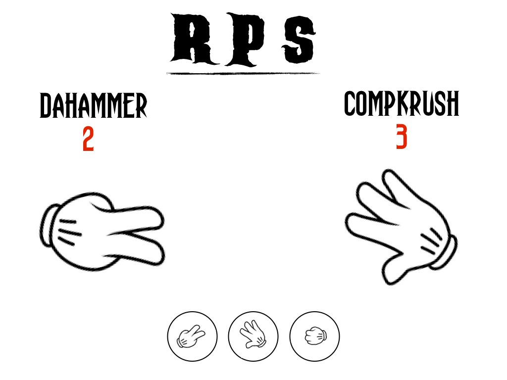
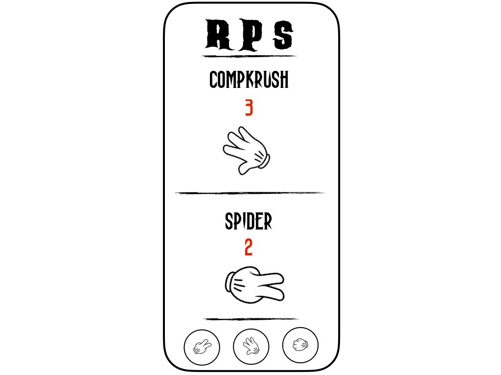
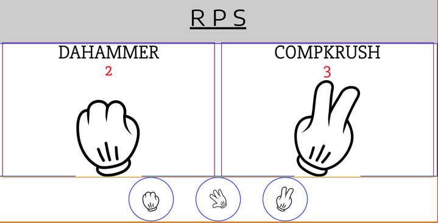

## (Rock, Paper, Scissors) ReadMe

#### Intro
Title: R S P

This **R P S** game will use the standard rules of the *Rock, Paper, Scissors* game but made into a React app.  A single player will choose her/his play while the computer is programmed to give a random answer.  The score is kept and when the player/computer reaches '3', the game is won.  Score is reset.

#### Setup
1. Sketch initial page layout.

  

  

2. Make static HTML page with this initial layout along with CSS Flexbox
  

3. Start React project
4. Divide HTML page into React components and move CSS over to component stylesheets.
5. Determine methods for UI functionality and which states will change and any onClick events to handle.

#### Usage
This *R P S* project is part of my exercises to take basic JavaScript projects (which are part of the React course at Code Academy), and make them into basic React apps.  I'm also using these exercises to practice *app workflow* from sketching to first MVP to feature requests.
