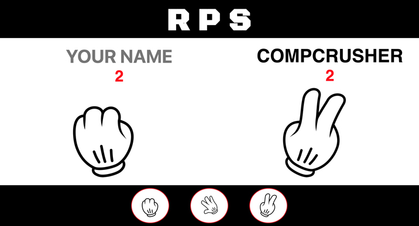
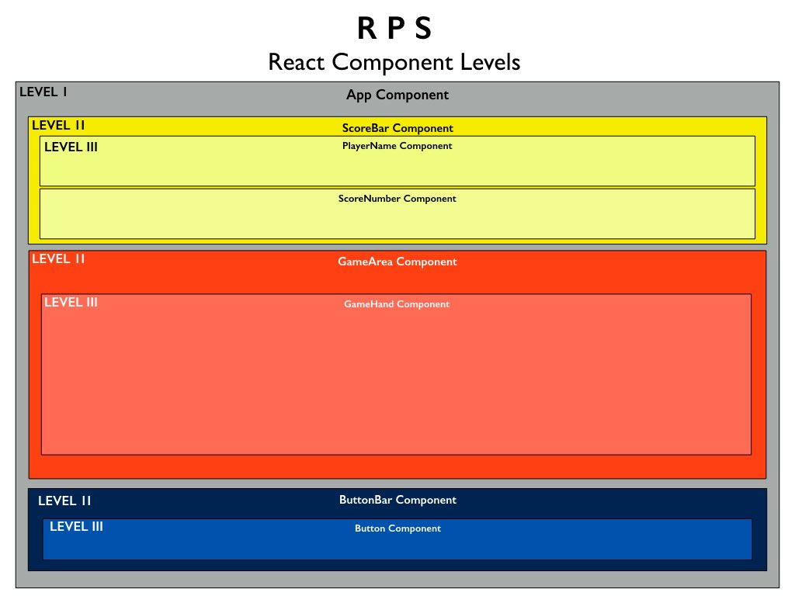

__Title__: R P S
By: Steve Hanlon Nov. 23, 2017

__Goal__: Develop a React App based on the Rock, Paper, Scissors game.  One player plays the computer in a first-to-win-three match.

#### Work flow
1. Develop index.html static site with hard-coded content.

2. Create React project
3. Create Components based on HTML static site then create Component Directories with JS and CSS files.
4. Copy/Paste the hard-coded HTML and CSS into the various React components, rewrite file/link paths

5. Create logic through methods, pass props, onClick and onChange handlers
  - App
    - Get Hands appearing on DOM
    - Get Score to increment based on outcome
    - Get referee call messages to show on DOM
  - GameArea
  - ScoreBar
  - ButtonBar
  - Button
    - Set up onClick handler and State of player choice

#### Programming flow
**Component Level Map**

**Component Mapping**

- **App** component - to handle logic and states and render gameArea component, header Title

 - **GameArea** component renders ScoreBar, GameHand, ButtonBar
   - GameHand component - use state to set state of hand images
 - **ScoreBar** component - to handle score logic (increment score) and Winner state, player name (input) and computer name (hardcoded), renders
   - PlayerName component
   - ScoreNumber component
 - **ButtonBar** component
   - Button component - onClick for each button to control the GameHand for your player (note: Computer's hand will be picked separately)

#### Future Feature Requests
